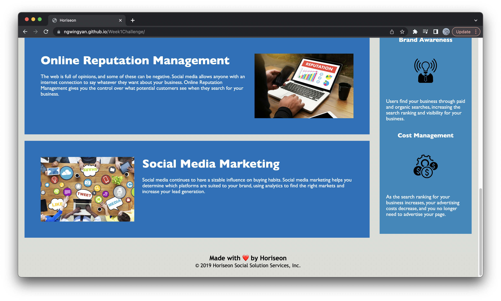

# Code Refactor

## Description

To create a website following accessibility standards
so that it is optimized for search engines

## Usage
When pressing top navigation bar, it will direct you to the appropriate part of the page

## Link
- Repository URL - https://github.com/ngwingyan/Week1Challenge/
- Deployed URL - https://ngwingyan.github.io/Week1Challenge/

## License
Please refer to the LICENSE in the repo.